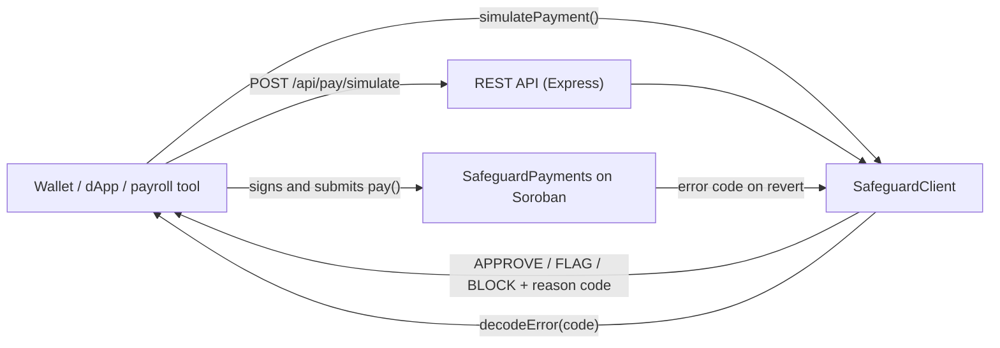

# Safeguard Backend & SDK

[](https://github.com/Safeguard-Inc/safeguard-backend/actions/workflows/ci.yml)
[](https://stellar.expert/explorer/testnet/contract/CDC6KVX7QT7CD3GOVGX44NQUNS7FMSZKIAXTV3TDGSXQKJRQMDZRSRCN)
[](tsconfig.json)
[](LICENSE)

**TypeScript SDK and REST API for integrating Safeguard policy-guarded
payments into wallets, payroll tools and merchant backends on Stellar.**

The backend answers one question before a user signs anything: *will this
payment settle, be escrowed, or be blocked, and why?* It also turns numeric
contract errors into messages people can act on.

[](https://safeguard-docs.vercel.app/assets/video/safeguard-pitch.mp4)

---

## Table of contents

- [The Safeguard stack](#the-safeguard-stack)
- [What's in this repo](#whats-in-this-repo)
- [How it fits together](#how-it-fits-together)
- [Quickstart](#quickstart)
- [SDK reference](#sdk-reference)
- [REST API reference](#rest-api-reference)
- [Decision model](#decision-model)
- [Configuration](#configuration)
- [Development](#development)
- [Project status and roadmap](#project-status-and-roadmap)
- [Contributing](#contributing)
- [License](#license)

---

## The Safeguard stack

| Repository | What it is | Tech |
| :--- | :--- | :--- |
| [`safeguard-contracts`](https://github.com/Safeguard-Inc/safeguard-contracts) | On-chain payments gateway, escrow and policy registry | Rust, Soroban SDK |
| **`safeguard-backend`** (this repo) | TypeScript SDK and REST API | TypeScript, Express, Zod |
| [`safeguard-dashboard`](https://github.com/Safeguard-Inc/safeguard-dashboard) | Operator console | Next.js 14, Tailwind |
| [`safeguard-docs`](https://github.com/Safeguard-Inc/safeguard-docs) | Docs site, live engine demo, pitch video | Static HTML/ESM |

**Live Testnet contracts** (see the
[deployment record](https://github.com/Safeguard-Inc/safeguard-contracts/blob/main/deployments/testnet.json)):

| Contract | ID |
| :--- | :--- |
| SafeguardPayments | [`CDC6KVX7QT7CD3GOVGX44NQUNS7FMSZKIAXTV3TDGSXQKJRQMDZRSRCN`](https://stellar.expert/explorer/testnet/contract/CDC6KVX7QT7CD3GOVGX44NQUNS7FMSZKIAXTV3TDGSXQKJRQMDZRSRCN) |
| SafeguardPolicy | [`CCXFDOLLLFZKAG7X6AKN2YLKET5F5X565IHZXPOAGCM7W6MJG5WKANLN`](https://stellar.expert/explorer/testnet/contract/CCXFDOLLLFZKAG7X6AKN2YLKET5F5X565IHZXPOAGCM7W6MJG5WKANLN) |
| Native XLM SAC | `CDLZFC3SYJYDZT7K67VZ75HPJVIEUVNIXF47ZG2FB2RMQQVU2HHGCYSC` |

## What's in this repo

| Component | Path | Purpose |
| :--- | :--- | :--- |
| **SDK** | [`src/sdk/`](src/sdk) | `SafeguardClient`: pre-flight decisions, error decoding, Testnet config |
| **Error catalog** | [`src/errors/catalog.ts`](src/errors/catalog.ts), [`docs/ERROR_CODES.md`](docs/ERROR_CODES.md) | 270 structured codes with mnemonic, domain, HTTP status and remediation |
| **REST API** | [`src/server/`](src/server) | Express service exposing the SDK over HTTP, with Zod validation |
| **Tests** | [`test/sdk.test.ts`](test/sdk.test.ts) | Decision paths and catalog integrity (`node:test` via `tsx`) |

## How it fits together



## Quickstart

```bash
git clone https://github.com/Safeguard-Inc/safeguard-backend
cd safeguard-backend
npm ci
npm test            # 5 tests
npm run build       # compiles to dist/
npm start           # REST API on http://localhost:4000
```

Your first request:

```bash
curl -s -X POST http://localhost:4000/api/pay/simulate \
  -H "Content-Type: application/json" \
  -d '{
    "sender":    "GC5MCMHHMFV7GOQ7DVN7MOTMHGTMVIP3YFQAAVFZ6WKUE6SLGQBVODW4",
    "recipient": "GA6LW724VD6PVAG6U3Z3I34D7BOWPO6J7MIJATKGKEC6TYORN4SRCVLT",
    "token":     "CDLZFC3SYJYDZT7K67VZ75HPJVIEUVNIXF47ZG2FB2RMQQVU2HHGCYSC",
    "amount":    "1500000000"
  }'
```

```json
{
  "success": true,
  "data": {
    "decision": "FLAG",
    "reason": "Payment exceeds spend cap threshold; will be held in on-chain Escrow for review",
    "reasonCode": 6,
    "isEscrow": true,
    "spendCap": "1000000000",
    "estimatedFeeStroops": 739309,
    "timestamp": 1791234567
  }
}
```

That is the same outcome the live contract produced for an identical
150 XLM payment:
[tx `2d832316…`](https://stellar.expert/explorer/testnet/tx/2d83231685f03b17e1a001e6c82c38453459b4f67b416ef60f9be73133026f0e).

## SDK reference

```ts
import { SafeguardClient } from '@safeguard-inc/backend';

const sg = new SafeguardClient();          // defaults to the live Testnet contracts
sg.setSpendCap('1000000000');              // 100 XLM, matching the deployment
sg.setDenylist(['GCV4I3P3F2OMWYZGRXD5PR5AC3K7MUDSBMKDBPEMJ2MFHLVUAGJEK4DT']);

const r = await sg.simulatePayment({
  sender: 'G...', recipient: 'G...',
  token: 'CDLZFC3SYJYDZT7K67VZ75HPJVIEUVNIXF47ZG2FB2RMQQVU2HHGCYSC',
  amount: '500000000',                     // 50 XLM, in stroops, as a string
});
r.decision;   // 'APPROVE' | 'FLAG' | 'BLOCK'
r.reasonCode; // matches the contract's PaymentError numbering

const e = sg.decodeError(2001);
e.mnemonic;    // 'POLICY_NOT_FOUND'
e.remediation; // what to do about it
```

| Method | Returns | Notes |
| :--- | :--- | :--- |
| `new SafeguardClient(config?)` | client | `Partial<NetworkConfig>` overrides `rpcUrl`, `networkPassphrase`, `paymentContractId`, `policyContractId` |
| `simulatePayment(params)` | `Promise<SimulationResult>` | Applies the contract's rules locally, in the same order as `pay()` |
| `setSpendCap(stroops)` | `void` | Escrow threshold (default `1000000000`) |
| `setDenylist(addresses)` | `void` | Addresses that force `BLOCK` |
| `decodeError(code)` | `DecodedError` | Looks a code up in the 270-entry catalog |
| `getConfig()` | `NetworkConfig` | Active network and contract IDs |

## REST API reference

Base URL: `http://localhost:4000`. Every response has the shape
`{ success, data | error }`.

| Method | Path | Description |
| :--- | :--- | :--- |
| `GET` | `/health` | Status, version, network, contract config and uptime |
| `POST` | `/api/pay/simulate` | Body `{ sender, recipient, token, amount }`; `amount` must be an integer string. Returns `SimulationResult`, or `400` with Zod details |
| `GET` | `/api/policies` | Spend cap, escrow period and the active rule set with reason codes |
| `GET` | `/api/transactions` | Recent activity, seeded with real Testnet transactions you can open on StellarExpert |
| `GET` | `/api/errors/:code` | Decodes a numeric error code; `400` if the code isn't numeric |

## Decision model

Rules are checked in the same order the contract checks them; the first
match wins.

| # | Check | Decision | `reasonCode` | Fee measured on Testnet |
| :---: | :--- | :--- | :---: | ---: |
| 1 | `amount <= 0` | `BLOCK` | 5 | 0, fails in simulation |
| 2 | Sender denylisted | `BLOCK` | 12 | 0, fails in simulation |
| 3 | Recipient denylisted | `BLOCK` | 11 | 0, fails in simulation |
| 4 | External `PolicyContract` denies party | `BLOCK` | 7 | 0, fails in simulation |
| 5 | `amount > spendCap` | `FLAG` (escrow) | 6 | 739,309 stroops |
| 6 | Otherwise | `APPROVE` | 0 | 19,237 stroops |

Fee figures come from
[safeguard-contracts/docs/BENCHMARKS.md](https://github.com/Safeguard-Inc/safeguard-contracts/blob/main/docs/BENCHMARKS.md).

### Two-Tier Error Architecture

1. **On-Chain Soroban Execution Codes (22 codes):** Lean, byte-optimized contract error enums (`PaymentError` 1-12 and `ContractError` 2-15) executed directly in WASM bytecode.
2. **Protocol Compliance Taxonomy (270 diagnostic codes):** Maintained in [`src/errors/catalog.ts`](src/errors/catalog.ts) and [`docs/ERROR_CODES.md`](docs/ERROR_CODES.md), categorizing compliance failures across 9 regulatory domains (Identity, Sanctions, Jurisdiction, Velocity, Travel Rule, Escrow, etc.) for off-chain oracles, indexers, and client applications.

> [!IMPORTANT]
> `simulatePayment` runs **locally**: it mirrors the contract's logic but
> does not yet read on-chain state over Soroban RPC. Keep `setSpendCap` and
> `setDenylist` in sync with the contract (`get_config`, `is_denylisted`).
> Switching to RPC simulation is the top roadmap item below.

## Configuration

| Variable | Default | Description |
| :--- | :--- | :--- |
| `PORT` | `4000` | HTTP port for the REST API |

Network and contract IDs default to `TESTNET_CONFIG` in
[`src/sdk/types.ts`](src/sdk/types.ts). Pass overrides to the
`SafeguardClient` constructor.

## Development

```bash
npm ci
npm test              # node:test via tsx
npx tsc --noEmit      # type-check
npm run build         # dist/
npm start             # run the compiled server
```

CI ([`.github/workflows/ci.yml`](.github/workflows/ci.yml)) runs install,
type-check, tests and build on every push and pull request.

## Project status and roadmap

| Status | Item |
| :---: | :--- |
| ✅ | SDK decision mirror that matches live contract results |
| ✅ | 270-code error catalog with remediation guidance |
| ✅ | REST API with Zod validation |
| 🔜 | **Real pre-flight**: build `pay()` XDR and call `simulateTransaction` on Soroban RPC |
| 🔜 | Read `get_config` / `is_denylisted` live instead of using local mirrors |
| 🔜 | Event indexer for `pay`, `esc_rel` and `esc_ref` to back `/api/transactions` |
| 🔜 | Environment variables for RPC URL and contract IDs |
| 🔜 | Publish `@safeguard-inc/backend` to npm |
| 🔜 | Route-level tests with supertest, plus a coverage badge |

## Contributing

We welcome community contributions and pull requests. Each roadmap item is a scoped issue with acceptance criteria:
[browse open issues](https://github.com/Safeguard-Inc/safeguard-backend/issues).
Claim one with a comment, then fork, branch, and make sure `npm test` and
`npx tsc --noEmit` pass before opening a PR. See
[CONTRIBUTING.md](CONTRIBUTING.md).

## License

[Apache-2.0](LICENSE)
